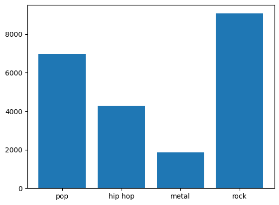

# PySpark Music User Data Analysis
Using Datasets related to a online music service and analysing user taste in music
# PySpark Music-User Data Analysis
## Overview
Analyzed user music preferences from an online music service dataset to compute genre trends and visualize artist counts using PySpark in Google Colab. The dataset includes two CSV files: `listening.csv` (user listening data) and `genre.csv` (artist genres)
## Tools
- PySpark 3.5, Google Colab, **Matplotlib**: For data visualization
## Steps
 1. Loaded `listening.csv` and `genre.csv` into Spark DataFrames using `spark.read.csv()`.
 2. Joined DataFrames on artist ID using `df.join()` to link user listens with genres.
 3. Grouped by genre (pop, rock, metal, hip hop) using `df.groupBy('genre').count()` to count artists.
 4. Visualized artist counts per genre with a Matplotlib bar chart.
## How to Run
 1. Open `PySpark_Data_Processing_and_Visualization.ipynb` in [Google Colab](https://colab.research.google.com/).
 2. Install PySpark and Matplotlib: `!pip install pyspark matplotlib`.
 3. Download datasets:
    - `listening.csv`: [Google Drive](https://drive.google.com/your-listening-link)
    - `genre.csv`: [Google Drive](https://drive.google.com/your-genre-link)
 4. Upload CSVs to Colab and run all cells.
## Results
 
*Bar chart showing artist counts for pop, rock, metal, and hip hop genres, created with Matplotlib.*
## Dataset
- **Source**: Online music service data (e.g., inspired by Kaggle )
 - **Files**:
   - `listening.csv`: User listening data (columns: user_id, artist_id, listen_count)
   - `genre.csv`: Artist genres (columns: artist_id, genre)
 - **Access**: Hosted on Google Drive:
   - [listening.csv](https://drive.google.com/file/d/11_HmJIATLb8mXGswkBZNIklratHboN8r/view?usp=drive_link)
   - [genre.csv](https://drive.google.com/file/d/14yvacjpS-z4TG546gkdkGC-o6E3kdo0L/view?usp=drive_link)
 - **Note**: Links are set to "Anyone with the link can view."

 ## Learnings
 - Mastered PySpark DataFrame operations (joins, groupBy, aggregations).
 - Developed data visualization skills with Matplotlib and Spark.
 - Prepared for Databricks Data Engineer Associate certification.
